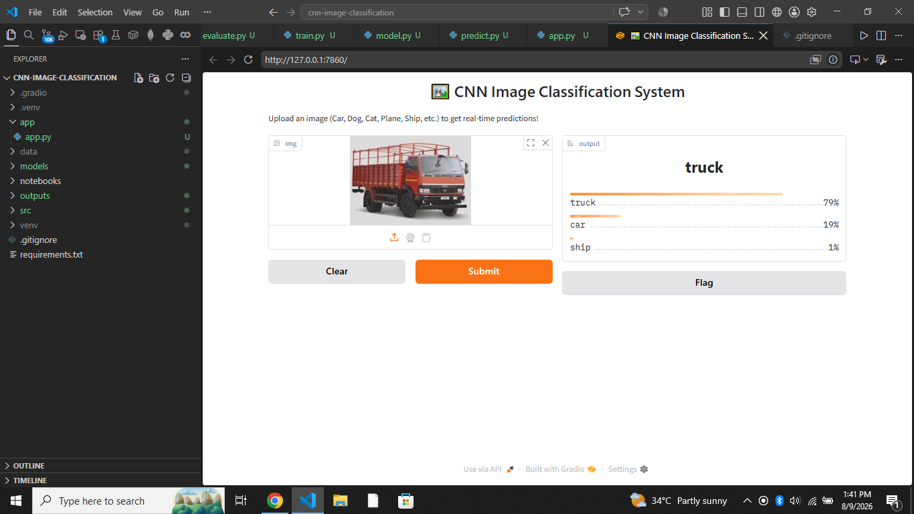

# 📸 CIFAR-10 CNN Image Classification System

An end-to-end Deep Learning project using **PyTorch** and **Gradio** to classify images into 10 distinct CIFAR-10 categories (`plane`, `car`, `bird`, `cat`, `deer`, `dog`, `frog`, `horse`, `ship`, `truck`) in real time.

---

## 🛠️ Tech Stack & Libraries
* **Language:** Python
* **Deep Learning Framework:** PyTorch & Torchvision
* **Frontend Web Interface:** Gradio
* **Data Evaluation & Plotting:** Matplotlib, Seaborn, Scikit-Learn, NumPy, Pillow

---

## 📂 Project Structure
```text
CNN-IMAGE-CLASSIFICATION/
├── app/
│   └── app.py            # Gradio Web Interface
├── src/
│   ├── dataset.py        # CIFAR-10 Data augmentation & DataLoader setup
│   ├── model.py          # Convolutional Neural Network (CNN) architecture
│   ├── train.py          # Model training & validation loop
│   ├── evaluate.py       # Classification report & Confusion Matrix generator
│   └── predict.py        # Command-line single image inference script
├── models/               # Saved PyTorch model weights (.pth)
├── outputs/              # Evaluation plots and metrics
├── image.png              # Web App Interface Screenshot
├── requirements.txt      # Project python dependencies
└── README.md             # Project documentation

🚀 Getting Started
1. Install Dependencies
Bash
pip install -r requirements.txt
2. Run the Web Application
Bash
python app/app.py
Open http://127.0.0.1:7860/ in your browser to test the interactive UI.

3. Train the Model (Optional)
Bash
python src/train.py
4. Evaluate Model Performance
Bash
python src/evaluate.py

## 🖥️ Web App Interface


